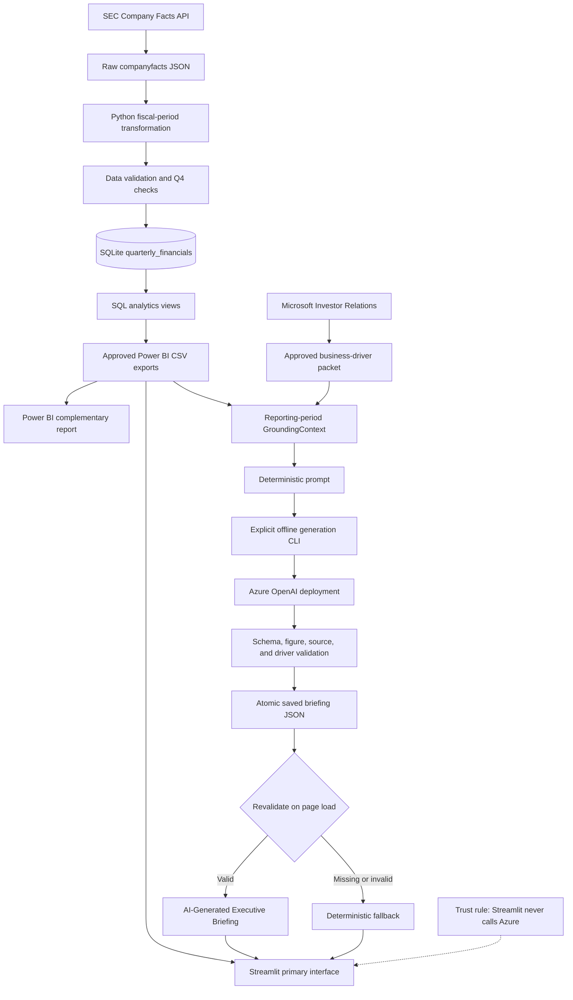

# Microsoft Financial Intelligence Platform

An end-to-end financial data and decision-support platform that turns Microsoft’s public financial disclosures into validated quarterly analytics, executive dashboards, and source-grounded briefing infrastructure.

The primary user is a business professional who needs to understand how Microsoft is performing, what changed, what is driving the change, and what deserves attention—without spending hours reconciling SEC filings and earnings materials.

> Project status: the data pipeline, analytics layer, Streamlit application, Power BI report, AI grounding and validation workflow, Azure OpenAI adapter, and offline generation CLI are implemented and tested. Live Azure generation is still pending a compatible deployment and available quota. No production AI briefing is included in this repository.

## What the platform does today

- Downloads Microsoft Company Facts data from the SEC.
- Selects the correct fiscal-period observations and derives Q4 from validated full-year and nine-month values when needed.
- Validates and loads normalized quarterly financials into SQLite.
- Centralizes growth and margin calculations in reusable SQL analytics views.
- Exports approved CSV datasets for application and Power BI consumption.
- Presents current, quarterly, and historical performance in a three-page Streamlit application.
- Includes a complementary Power BI report at `dashboards/powerbi/Microsoft_Financial_Intelligence_Platform.pbix`.
- Builds a reporting-period-specific `GroundingContext` from approved financial exports.
- Enriches FY2026 Q4 with an approved Microsoft Investor Relations business-driver packet.
- Validates structured executive briefings against approved periods, figures, classifications, and source IDs.
- Loads a saved, validated AI-generated briefing when one exists; otherwise shows deterministic insights from `src/insights.py` without calling them AI-generated.
- Provides an explicit offline Azure generation CLI. Streamlit never calls Azure during page rendering.

## Validated FY2026 Q4 example

The latest approved example reports:

| Measure | FY2026 Q4 value |
|---|---:|
| Revenue | $90.007B |
| Quarter-over-quarter revenue growth | 8.59% |
| Year-over-year revenue growth | 17.75% |
| Gross margin | 67.20% |
| Operating margin | 45.11% |
| Net margin | 39.74% |

The approved business-driver packet also supports deterministic segment contribution analysis. Intelligent Cloud contributed 69.50% of the $13.566B year-over-year revenue increase, Productivity and Business Processes contributed 34.90%, and More Personal Computing was a −4.40% headwind. Contribution percentages are derived by the platform and are not presented as Microsoft-reported figures.

## Product experience

Streamlit is the primary product interface:

1. **Executive Overview** — latest performance, growth, margins, trend, and validated briefing selection.
2. **Quarterly Performance** — selected financial metric and profitability trends.
3. **Historical Trends** — complete annual performance from FY2019 onward.

Power BI is a complementary reporting layer backed by the same approved SQL views and exports. It supports governed business reporting rather than replacing the primary Streamlit experience.

No screenshots are currently stored in the repository, so this README does not use placeholder or fabricated images.

## Architecture



Streamlit has no path to the Azure provider. See [Architecture](docs/architecture.md) and [AI methodology](docs/ai_methodology.md) for trust boundaries and failure behavior.

## Technology stack

- Python 3.13
- pandas and Pydantic
- SQLite and SQL analytics views
- Streamlit and Plotly
- Power BI
- Official OpenAI Python SDK using the Azure OpenAI v1 endpoint
- pytest and GitHub Actions
- SEC Company Facts and approved Microsoft Investor Relations disclosures

## AI grounding and validation

AI is treated as an optional presentation layer, not a financial calculation engine.

- A generic `ReportingPeriod` identifies the requested fiscal quarter.
- Financial context comes only from approved `data/powerbi` exports.
- Q1–Q3 grounding prevents same-fiscal-year annual look-ahead; Q4 may use the completed annual result.
- An approved business-driver packet separates reported facts, derived metrics, management explanations, and source metadata.
- Every structured claim is checked against its metric, period, value, unit, classification, and source ID.
- Integer USD and count claims require exact equality. Percentages use a deterministic 0.01 percentage-point tolerance.
- Unsupported sources, invented figures, unsupported drivers, missing attribution, stale periods, and malformed output are rejected.
- Saved JSON is atomically written only after validation and revalidated on every load.
- Missing or invalid saved output triggers the deterministic fallback.
- Prompts prohibit browsing, external data, forecasts, price targets, investment advice, and buy/sell language.

See [AI methodology](docs/ai_methodology.md) and [Azure generation](docs/azure_ai_generation.md).

## Repository structure

```text
.
├── app.py                         # Streamlit application
├── dashboards/powerbi/            # Complementary Power BI report
├── data/
│   ├── raw/                        # SEC Company Facts JSON
│   ├── processed/                  # Transformed CSV and SQLite database
│   ├── powerbi/                    # Approved analytics exports
│   └── approved/business_drivers/  # Period-specific approved source packets
├── docs/                           # Product, architecture, methodology, and launch docs
├── python/                         # ETL, validation, export, and AI generation commands
├── sql/                            # Analytics and dashboard views
├── src/
│   ├── ai/                         # Grounding, providers, validation, storage, selection
│   ├── data_loader.py
│   ├── insights.py                 # Deterministic fallback
│   └── charts.py
├── tests/                          # Deterministic unit and integration tests
└── .github/workflows/tests.yml     # Secret-free CI validation
```

## Local setup

From the repository root:

```bash
python3 -m venv .venv
source .venv/bin/activate
python3 -m pip install --upgrade pip
python3 -m pip install -r requirements.txt -r requirements-dev.txt
```

The approved exports and SQLite database are already present. To rebuild the exports from the current database:

```bash
python3 python/build_powerbi_dataset.py
```

Run the primary interface:

```bash
python3 -m streamlit run app.py
```

## Validation and tests

```bash
python3 -m py_compile src/ai/*.py python/*.py
python3 -m pytest -q
```

The final Phase 5 verification passes 86 tests. CI runs the same compilation and pytest checks without Azure credentials or network generation.

## Azure generation

Dry-run validates configuration, period grounding, prompt construction, and destination without contacting Azure or writing a briefing:

```bash
python3 python/generate_ai_briefing.py --period FY2026-Q4 --dry-run
```

Real generation requires `AZURE_OPENAI_ENDPOINT`, `AZURE_OPENAI_API_KEY`, `AZURE_OPENAI_DEPLOYMENT`, a compatible deployment, and available quota:

```bash
python3 python/generate_ai_briefing.py --period FY2026-Q4
```

Live Azure generation has not yet been validated because deployment/quota access is pending. The command must not be represented as operational until it successfully generates, validates, saves, and reloads a briefing in the target environment.

## Security practices

- Credentials are read only from environment variables.
- `.env` and `.streamlit/secrets.toml` are ignored.
- Generated briefing JSON is ignored by default.
- Prompts, raw responses, keys, and provider metadata are not logged.
- The Azure adapter has an explicit timeout and disables SDK retries.
- CI requires no secrets and all providers are mocked in tests.
- Streamlit reads only saved output and cannot spend Azure quota during rendering.

## Product decisions and tradeoffs

- **Trust before fluency:** structured claims must validate even if that rejects otherwise polished text.
- **SQL as calculation authority:** Python and BI surfaces consume approved calculations instead of recreating them.
- **Saved generation over live page calls:** this improves reliability, cost control, auditability, and fallback behavior at the expense of real-time generation.
- **Approved packets over open retrieval:** business drivers are narrower but traceable and protected from invented explanations.
- **Streamlit primary, Power BI complementary:** Streamlit supports the product workflow; Power BI supports conventional reporting.
- **Deterministic fallback:** the experience remains useful when Azure, quota, packets, or saved output are unavailable.

## Current limitations and pending work

- Live Azure generation awaits a compatible deployment and available quota.
- User research is planned but has not been conducted; see [User research plan](docs/user_research.md).
- SEC accession numbers exist in the base table but are not yet exposed through analytics views or briefing citations.
- Only FY2026 Q4 currently has an approved business-driver packet.
- The platform covers Microsoft only and does not provide peer benchmarking, valuation, forecasting, or investment advice.
- Generated briefings are offline artifacts; there is no scheduling, approval UI, user account system, or production deployment pipeline.
- The project is not affiliated with, endorsed by, or validated by Microsoft.

## Interview-ready summary

I built the Microsoft Financial Intelligence Platform to demonstrate how product thinking, data engineering, analytics, and trustworthy AI can work as one system. It ingests public SEC facts, fixes fiscal-period selection and Q4 derivation, validates the data, centralizes analytics in SQLite views, and serves an executive Streamlit experience plus a complementary Power BI report. I then added a provider-independent AI workflow that grounds every briefing in approved financial and Investor Relations data, rejects unsupported claims, persists only validated JSON, and falls back deterministically. The Azure adapter and CLI are implemented and fully mocked in tests; live generation remains honestly blocked on deployment and quota.

## Documentation

- [Vision](docs/vision.md)
- [Product brief](docs/product_brief.md)
- [Product principles](docs/product_principles.md)
- [Decision framework](docs/decision_framework.md)
- [Dashboard design](docs/dashboard_design.md)
- [Metric inventory](docs/metric_inventory.md)
- [Architecture](docs/architecture.md)
- [AI methodology](docs/ai_methodology.md)
- [Azure generation](docs/azure_ai_generation.md)
- [User research plan](docs/user_research.md)
- [Demo script](docs/demo_script.md)
- [Launch notes](docs/launch_notes.md)
- [Development log](docs/development_log.md)
