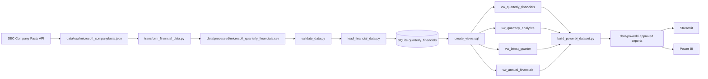
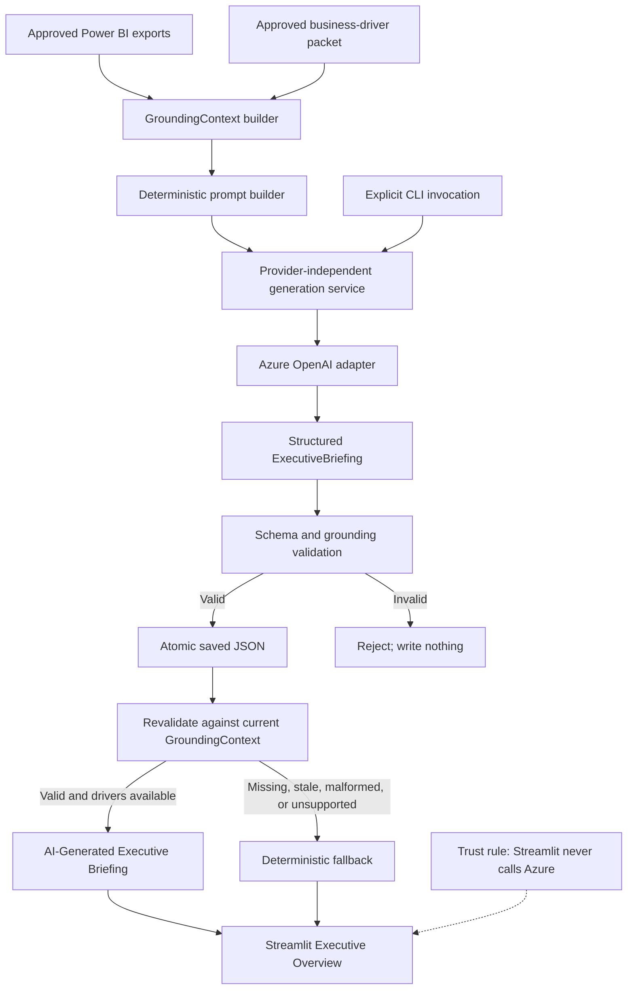

# Architecture

## System purpose

The Microsoft Financial Intelligence Platform converts public Microsoft financial disclosures into validated analytical datasets and an executive decision-support experience. Streamlit is the primary interface; Power BI is complementary. AI-generated briefings are optional, offline-generated artifacts that must pass the same trust boundary before Streamlit can display them.

## Financial data flow

### Transformation and Q4 derivation

The transformation selects observations belonging to the correct Microsoft fiscal year rather than automatically preferring later comparative filings. Q1–Q3 use quarter-duration observations. Q4 is derived from a validated full-year observation minus the corresponding nine-month observation when a standalone quarterly value is unavailable. The pipeline preserves integer-dollar values and rejects invalid period combinations.

### Analytics authority

SQLite stores normalized quarterly facts. SQL views calculate ordered fiscal periods, quarter-over-quarter and year-over-year revenue comparisons, margins, latest-quarter output, and annual summaries. `build_powerbi_dataset.py` exports only the approved views; Streamlit and Power BI do not recreate the financial calculations.

## AI briefing flow

### Approved business-driver packets

`data/approved/business_drivers/{period}.json` is the qualitative trust boundary. Each packet separates:

- official source metadata;
- reported company and product facts;
- reported segment results;
- management-attributed explanations;
- an empty location for stored derived metrics, because contribution calculations are performed in code.

FY2026 Q4 is the first approved packet. Missing packets are represented explicitly as unavailable; the platform never invents drivers for those periods.

### GroundingContext

`GroundingContext` is built for a generic `ReportingPeriod`. It contains the requested quarter, available comparison quarters, the most recently completed annual context, financial source IDs, and optional approved business drivers. Interim quarters cannot receive same-fiscal-year annual results, preventing look-ahead leakage.

### Provider and CLI boundary

The generation service depends on `BriefingProvider`, not Azure directly. The Azure adapter is instantiated only by `python/generate_ai_briefing.py`. It uses the official OpenAI SDK with the normalized Azure v1 endpoint, an explicit timeout, disabled retries, no tools, and the deployment name as `model`.

The CLI supports dry-run, explicit replacement, and isolated output directories. Dry-run constructs grounding and the prompt but neither creates a provider nor writes a file.

## Trust boundaries

| Boundary | Trusted input | Enforcement |
|---|---|---|
| Financial ingestion | SEC Company Facts | Fiscal-period selection, duration checks, data validation |
| Analytics | SQLite facts | SQL-owned calculations and approved-view exports |
| Business drivers | Approved Microsoft Investor Relations packet | Strict schemas, source IDs, period checks, reconciliation |
| Model input | `GroundingContext` | Deterministic prompt; no browsing or tools |
| Model output | Structured JSON | Pydantic, period, figure, classification, driver, and source validation |
| Persistence | Fully approved briefing | Atomic replacement; invalid output is never saved |
| Presentation | Saved briefing plus current context | Revalidation on every load; deterministic fallback |

## Failure behavior

- Missing core quarterly metrics: grounding fails for that reporting period.
- Missing business-driver packet: financial context remains available, but AI briefing selection falls back deterministically.
- Missing Azure configuration: the CLI returns a nonzero exit code and lists only missing variable names.
- Azure failure, refusal, empty output, or malformed structure: generation fails with a concise exception; nothing is saved.
- Unsupported period, figure, source, classification, explanation, or driver: validation rejects the briefing.
- Existing briefing without `--replace`: CLI refuses before constructing the provider.
- Invalid or stale saved JSON: Streamlit suppresses technical details and uses deterministic insights.
- Streamlit rendering: never calls Azure and therefore cannot consume generation quota.

## Interfaces and artifacts

- Primary interface: `app.py`
- Complementary report: `dashboards/powerbi/Microsoft_Financial_Intelligence_Platform.pbix`
- Financial exports: `data/powerbi/*.csv`
- Approved driver packets: `data/approved/business_drivers/*.json`
- Generated briefings: `data/generated/briefings/*.json` (ignored by Git)
- AI implementation: `src/ai/`
- Offline generation: `python/generate_ai_briefing.py`

See [AI methodology](ai_methodology.md) for claim-level rules and [Azure generation](azure_ai_generation.md) for operation.
